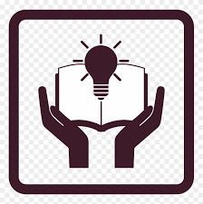

# Intership-portofolio-website-development-
How to ReadMe:

Step 01: To create our internship project I have used visual studio code as a tool.
Step 02: In my main folder there are many files as been created for different programming languages.
Step 03: At first html file should be created.
•	HTML is a Hypertext markup language file format used as the basic of a web page.
•	In my html file I have created the outline for my portfolio website.
•	The html tags are used for defining headings, paragraph, lists, links, quotes and interactive forms.
•	Html can be used for embed JavaScript and CSS. 

Code for HTML: [File name – index.html]
<!DOCTYPE html>
<html lang="en">
<head>
    <meta charset="UTF-8">
    <meta name="viewport" content="width=device-width, initial-scale=1.0">
    <title>Ganhavi's Portfolio Website</title>
    <link rel="stylesheet" href="style.css">
    
    
    
    
    
    <link rel="stylesheet" href="https://cdnjs.cloudflare.com/ajax/libs/OwlCarousel2/2.3.4/assets/owl.carousel.min.css"/>

</head>
<body>
    

        <i class="fas fa-angle-up"></i>
    

    <nav class="navbar">
        

            
<a href="#">Portfolio.</a>

            <ul class="menu">
                <li><a href="#home" class="menu-btn">Home</a></li>
                <li><a href="#about" class="menu-btn">About</a></li>
                <li><a href="#projects" class="menu-btn">Projects</a></li>
                <li><a href="#skills" class="menu-btn">Skills</a></li>
                <li><a href="#prowess" class="menu-btn">Prowess</a></li>
                <li><a href="#contact" class="menu-btn">Contact</a></li>
            </ul>
            

                <i class="fas fa-bars"></i>
            

        

    </nav>

    <!-- home section start -->
    <section class="home" id="home">
        

            

                
Hello, I'm

                
Ganhavi R

                
Computer Science Engineering Student

                
And I'm a 

                <a href="#">Hire me</a>
            

        

    </section>

    <!-- about section start -->
    <section class="about" id="about">
        

            <h2 class="title">About me</h2>
            

                

                    
                

                

                    
I'm Ganhavi R and I'm a 

                    
 Hello the one, and thank you for visiting my website . Let tell you about myself. I am pursuing my BE currently in Bangalore,i'm interested in blogging,influencing,programming, task Management,projectmanagement with  techinical & non-techhnical skills where in addition  some of prowess ...I love exploring new things and learn new skills but somehow I think today is going to go better…

                

            

        

    </section>

    <!-- services section start -->
    <section class="projects" id="projects">
        

            <h2 class="title">My Projects</h2>
            

                

                

                    

                        <i class="fas fa-stethoscope"></i>
                        
<b>Hospital Management System</b>

                        
The purpose of the project entitles as “HOSPITAL MANAGEMENT SYSTEM” is to computerized the front office management of hospital to develop software which is users friendly, simple, fast. The main function of the system is to store the database of patient , doctor and staff of the hospital.

                    

                

            

            

            

                

                    

                        <i class="fas fa-robot"></i>
                        
<b>Walking Robot</b>

                        
 This is an animation to view a walking robot. There are options to manipulate the robot.

                    

                

            
            

            

            

                

                

                    

                        <i class="fas fa-sun-o"></i>
                        
<b>Horoscope</b>

                        
A horoscope is simply an astrological diagram or chart which represents the position of the sun, moon, planets and other astrological aspects/ parameter at the time of person’s birth therefore we have proposed a webbased application which provides daily horoscope and knowledge related to their horoscope and they can talk to astrologer, can consult vastu and have solution to their problem. 

                    

                
 
            

        

    </section>

    <!-- skills section start -->
    <section class="skills" id="skills">
        

            <h2 class="title">Programming Languages </h2>
            

                

         
My programming language skills & experiences.

                    
Being a cse student,It's normal to learn the some of the programming languages.So  these are the programming languages I been through with % which says how well I  know the respective languages  .

                    <a href="#">Read more</a>
                

                

                    

                        

                            Java & J2EE
                            90%
                        

                        

                    

                    

                        

                            C & C++
                            85%
                        

                        

                    

                    

                        

                            HTML&CSS
                            80%
                        

                        

                    

                    

                        

                            Python
                            70%
                        

                        

                    

                    

                        

                            MySQL
                            65%
                        

                        

                    

                

            

        

    </section>

    <! -- teams section start -->
    <section class="prowess" id="prowess">
        

         
            <h2 class="title">My add-on Prowess</h2>
            

                

                    

                        
                        
Cloud Computing

                        
                    

                

                

                    

                        
                        
Wireless Networking

                        
                    

                

                

                    

                        
                        
Data Analysis

                        
                    

                

                

                    

                        
                        
Project Management

                        
                    

                

                

                    

                        
                        
Task Management

                        
                    

                

            

        

    </section>

    <!-- contact section start -->
    <section class="contact" id="contact">
        

            <h2 class="title">Contact me</h2>
            

                

                    
Get in Touch

                    

                        

                            <i class="fas fa-user"></i>
                            

                                
Name

                                
Ganhavi R

                            

                        

                        

                            <i class="fas fa-map-marker-alt"></i>
                            

                               
Address

                               
Bangalore Karnataka

                            

                        

                        

                            <i class="fas fa-envelope"></i>
                            

                               
Email

                               
1hk17cs175@hkbk.edu

                            

                        

                    

                

                

                    
Message me

                    <form  method="POST"  action="">
                    
                        

                            

                   <input type="text" placeholder="Name" required name="name">
                            

                            

               <input type="text" placeholder="Email" required  email="email">
                            

                        

                        

           <input type="text" placeholder="Mobile Number" required ph="phone">
                        

                        

<textarea cols="30" rows="10" placeholder="Message.." required  msg="message"></textarea>
                        

                        

                            <button type="submit">Send message</button>
                        

                    </form>
                

            

        

    </section>

    <!-- footer section start -->
    <footer>
        Created By <a href="https://www.abc.com">Ganhavi R</a> |  sample work .
    </footer>

    
</body>
</html>

Step 04: After creation of html file for adding styling CSS is been used. 
•	CSS is the language used to style an HTML document and it describes how HTML elements should be displayed.
•	For styling my HTML file I have created CSS file where CSS file is linked in HTML file for performing the operation.
•	In my CSS file I have a code for custom scroll bar, content styling codes, navbar styling, menu button styling, home section styling, about section styling, project section styling, skills section styling, team section styling, contact section styling, footer section styling, responsive media query start.

Code for CSS: [File name: style.css]
/*  import google fonts */
@import url('https://fonts.googleapis.com/css2?family=Poppins:wght@400;500;600;700&family=Ubuntu:wght@400;500;700&display=swap');

*{
    margin: 0;
    padding: 0;
    box-sizing: border-box;
    text-decoration: none;
}
html{
    scroll-behavior: smooth;
}

/* custom scroll bar */
::-webkit-scrollbar {
    width: 10px;
}
::-webkit-scrollbar-track {
    background: #f1f1f1;
}
::-webkit-scrollbar-thumb {
    background: #888;
}

::-webkit-scrollbar-thumb:hover {
    background: #555;
}

/* all similar content styling codes */
section{
    padding: 100px 0;
}
.max-width{
    max-width: 1300px;
    padding: 0 80px;
    margin: auto;
}
.about, .projects, .skills, .prowess, .contact, footer{
    font-family: 'Poppins', sans-serif;
}
.about .about-content, 
.projects .serv-content,
.skills .skills-content,
.contact .contact-content{
    display: flex;
    flex-wrap: wrap;
    align-items: center;
    justify-content: space-between;
}
section .title{
    position: relative;
    text-align: center;
    font-size: 40px;
    font-weight: 500;
    margin-bottom: 60px;
    padding-bottom: 20px;
    font-family: 'Ubuntu', sans-serif;
}
section .title::before{
    content: "";
    position: absolute;
    bottom: 0px;
    left: 50%;
    width: 180px;
    height: 3px;
    background: #111;
    transform: translateX(-50%);
}
section .title::after{
    position: absolute;
    bottom: -8px;
    left: 50%;
    font-size: 20px;
    color:rgba(180, 26, 39, 0.76);
    padding: 0 5px;
    background: #fff;
    transform: translateX(-50%);
}

/* navbar styling */
.navbar{
    position: fixed;
    width: 100%;
    z-index: 999;
    padding: 30px 0;
    font-family: 'Ubuntu', sans-serif;
    transition: all 0.3s ease;
}
.navbar.sticky{
    padding: 15px 0;
    background:rgb(219, 22, 48);
}
.navbar .max-width{
    display: flex;
    align-items: center;
    justify-content: space-between;
}
.navbar .logo a{
    color: #fff;
    font-size: 35px;
    font-weight: 600;
}
.navbar .logo a span{
    color:rgb(197, 115, 48);
    transition: all 0.3s ease;
}
.navbar.sticky .logo a span{
    color:rgb(14, 2, 2);
}
.navbar .menu li{
    list-style: none;
    display: inline-block;
}
.navbar .menu li a{
    display: block;
    color: #fff;
    font-size: 18px;
    font-weight: 500;
    margin-left: 25px;
    transition: color 0.3s ease;
}
.navbar .menu li a:hover{
    color:rgb(9, 20, 182);
}
.navbar.sticky .menu li a:hover{
    color: #fff;
}

/* menu btn styling */
.menu-btn{
    color: white;
    font-size: 23px;
    cursor: pointer;
    display: none;
}
.scroll-up-btn{
    position: fixed;
    height: 45px;
    width: 42px;
    background:rgb(219, 22, 48);
    right: 30px;
    bottom: 10px;
    text-align: center;
    line-height: 45px;
    color: #fff;
    z-index: 9999;
    font-size: 30px;
    border-radius: 6px;
    border-bottom-width: 2px;
    cursor: pointer;
    opacity: 0;
    pointer-events: none;
    transition: all 0.3s ease;
}
.scroll-up-btn.show{
    bottom: 30px;
    opacity: 1;
    pointer-events: auto;
}
.scroll-up-btn:hover{
    filter: brightness(90%);
}

  
/* home section styling */
.home{
    display: flex;
    background: url("home.jpg") no-repeat center;
    height: 100vh;
    color: rgb(53, 55, 58);
    min-height: 500px;
    background-size: cover;
    background-attachment: fixed;
    font-family: 'Ubuntu', sans-serif;
}
.home .max-width{
    margin: auto 0 auto 30px;
}
.home .home-content .text-1{
    font-size: 27px;
}
.home .home-content .text-2{
    font-size: 75px;
    font-weight: 600;
    margin-left: -3px;
}
.home .home-content .text-3{
    font-size: 40px;
    margin: 5px 0;
}
.home .home-content .text-3 span{
    color:rgb(219, 22, 48);
    font-weight: 500;
}
.home .home-content a{
    display: inline-block;
    background:rgb(204, 123, 30);
    color:black;
    font-size: 25px;
    padding: 12px 36px;
    margin-top: 20px;
    font-weight: 400;
    border-radius: 6px;
    border: 2px solid black;
    transition: all 0.3s ease;
}
.home .home-content a:hover{
    color: rgb(219, 22, 48);
    background: none;
}

/* about section styling */
.about .title::after{
    content: "who i am";
}
.about .about-content .left{
    width: 45%;
}
.about .about-content .left img{
    height: 400px;
    width: 400px;
    object-fit: cover;
    border-radius: 6px;
}
.about .about-content .right{
    width: 55%;
}
.about .about-content .right .text{
    font-size: 25px;
    font-weight: 600;
    margin-bottom: 10px;
}
.about .about-content .right .text span{
    color: rgb(219, 22, 48);
}
.about .about-content .right p{
    text-align: justify;
}
.about .about-content .right a{
    display: inline-block;
    background: saddlebrown;
    color: #fff;
    font-size: 20px;
    font-weight: 500;
    padding: 10px 30px;
    margin-top: 20px;
    border-radius: 6px;
    border: 2px solid saddlebrown;
    transition: all 0.3s ease;
}
.about .about-content .right a:hover{
    color: rgb(219, 22, 48);
    background: none;
}

/* projects section styling */
.projects, .prowess{
    color:#fff;
    background: #111;
}
.projects .title::before,
.prowess .title::before{
    background: #fff;
}
.projects .title::after,
.prowess .title::after{
    background: #111;
    content: "what i did";
}
.projects .serv-content .card{
    width: calc(50% - 30px);
    background: #222;
    text-align: center;
    border-radius: 8px;
    padding: 20px 25px;
    cursor:zoom-in;
    transition: all 0.3s ease;
}
.projects .serv-content .card:hover{
    background:rgb(15, 120, 134);
}
.projects.serv-content .card .box{
    transition: all 0.3s ease;
}
.projects .serv-content .card:hover .box{
    transform: scale(1.05);
}
.projects .serv-content .card i{
    font-size: 20px;
    color: saddlebrown;
    transition: color 0.3s ease;
}
.projects .serv-content .card:hover i{
    color: #fff;
}
.projects .serv-content .card .text{
    font-size: 20px;
    font-weight: 500;
    margin: 10px 0 7px 0;
}

/* skills section styling */

.skills .title::after{
    content: "what i know";
}
.skills .skills-content .column{
    width: calc(50% - 30px);
}
.skills .skills-content .left .text{
    font-size: 2vw;
    font-weight: 600;
    margin-bottom: 10px;
}
.skills .skills-content .left p{
    text-align: justify;
}
.skills .skills-content .left a{
    display: inline-block;
    background: saddlebrown;
    color: #fff;
    font-size: 18px;
    font-weight: 500;
    padding: 8px 16px;
    margin-top: 20px;
    border-radius: 6px;
    border: 2px solid saddlebrown;
    transition: all 0.3s ease;
}
.skills .skills-content .left a:hover{
    color: saddlebrown;
    background: none;
}
.skills .skills-content .right .bars{
    margin-bottom: 15px;
}
.skills .skills-content .right .info{
    display: flex;
    margin-bottom: 5px;
    align-items: center;
    justify-content: space-between;
}
.skills .skills-content .right span{
    font-weight: 500;
    font-size: 18px;
}
.skills .skills-content .right .line{
    height: 5px;
    width: 100%;
    background: lightgrey;
    position: relative;
}
.skills .skills-content .right .line::before{
    content: "";
    position: absolute;
    height: 100%;
    left: 0;
    top: 0;
    background: rgb(15, 120, 134);
}
.skills-content .right .html::before{
    width: 90%;
}
.skills-content .right .css::before{
    width: 60%;
}
.skills-content .right .js::before{
    width: 80%;
}
.skills-content .right .php::before{
    width: 50%;
}
.skills-content .right .mysql::before{
    width: 70%;
}

/* teams section styling */
.prowess .title::after{
    content: "Other than programming";
}
.prowess .carousel .card{
    background: #222;
    border-radius: 6px;
    padding: 25px 35px;
    text-align: center;
    overflow: hidden;
    transition: all 0.3s ease;
}
.prowess .carousel .card:hover{
    background: rgb(15, 120, 134);
    
}
.prowess .carousel .card .box{
    display: flex;
    flex-direction: column;
    align-items: center;
    justify-content: center;
    transition: all 0.3s ease;
}
.prowess .carousel .card:hover .box{
    transform: scale(1.05);
}
.prowess .carousel .card .text{
    font-size: 25px;
    font-weight: 500;
    margin: 10px 0 7px 0;
}
.prowess .carousel .card img{
    height: 150px;
    width: 150px;
    object-fit: cover;
    border-radius: 50%;
    border: 5px solid rgb(230, 12, 12);
    transition: all 0.3s ease;
}
.prowess .carousel .card:hover img{
    border-color: #fff;
}
.owl-dots{
    text-align: center;
    margin-top: 20px;
}
.owl-dot{
    height: 13px;
    width: 13px;
    margin: 0 5px;
    outline: none!important;
    border-radius: 50%;
    border: 2px solid saddlebrown!important;
    transition: all 0.3s ease;
}
.owl-dot.active{
    width: 35px;
    border-radius: 14px;
}
.owl-dot.active,
.owl-dot:hover{
    background:saddlebrown!important;
}

/* contact section styling */
.contact .title::after{
    content: "get in touch";
}
.contact .contact-content .column{
    width: calc(50% - 30px);
}
.contact .contact-content .text{
    font-size: 20px;
    font-weight: 600;
    margin-bottom: 10px;
}
.contact .contact-content .left p{
    text-align: justify;
}
.contact .contact-content .left .icons{
    margin: 10px 0;
}
.contact .contact-content .row{
    display: flex;
    height: 65px;
    align-items: center;
}
.contact .contact-content .row .info{
    margin-left: 30px;
}
.contact .contact-content .row i{
    font-size: 25px;
    color:saddlebrown;
}
.contact .contact-content .info .head{
    font-weight: 500;
}
.contact .contact-content .info .sub-title{
    color: #333;
}
.contact .right form .fields{
    display: flex;
}
.contact .right form .field,
.contact .right form .fields .field{
    height: 45px;
    width: 100%;
    margin-bottom: 15px;
}
.contact .right form .textarea{
    height: 80px;
    width: 100%;
}
.contact .right form .name{
    margin-right: 10px;
}
.contact .right form .email{
    margin-left: 10px;  
}
.contact .right form .field input,
.contact .right form .textarea textarea{
    height: 100%;
    width: 100%;
    border: 1px solid lightgrey;
    border-radius: 6px;
    outline: none;
    padding: 0 15px;
    font-size: 17px;
    font-family: 'Poppins', sans-serif;
    transition: all 0.3s ease;
}
.contact .right form .field input:focus,
.contact .right form .textarea textarea:focus{
    border-color: #b3b3b3;
}
.contact .right form .textarea textarea{
    padding-top: 10px;
    resize: none;
}
.contact .right form .button{
    height: 47px;
    width: 170px;
}
.contact .right form .button button{
    width: 100%;
    height: 100%;
    border: 2px solid saddlebrown;
    background: saddlebrown;
    color: #fff;
    outline: none;
    font-size: 20px;
    font-weight: 500;
    border-radius: 6px;
    cursor: pointer;
    transition: all 0.3s ease;
}
.contact .right form .button button:hover{
    color: saddlebrown;
    background: none;
}

/* footer section styling */
footer{
    background: #111;
    padding: 15px 23px;
    color: #fff;
    text-align: center;
}
footer span a{
    color: saddlebrown;
    text-decoration: none;
}
footer span a:hover{
    text-decoration: underline;
}

/* responsive media query start */
@media (max-width: 1300px) {
    .home .max-width{
        margin-left: 0px;
    }
}

@media (max-width: 1104px) {
    .about .about-content .left img{
        height: 350px;
        width: 350px;
    }
}

@media (max-width: 991px) {
    .max-width{
        padding: 0 50px;
    }
}
@media (max-width: 947px){
    .menu-btn{
        display: block;
        z-index: 999;
    }
    .menu-btn i.active:before{
        content: "\f00d";
    }
    .navbar .menu{
        position: fixed;
        height: 100vh;
        width: 100%;
        left: -100%;
        top: 0;
        background: #111;
        text-align: center;
        padding-top: 80px;
        transition: all 0.3s ease;
    }
    .navbar .menu.active{
        left: 0;
    }
    .navbar .menu li{
        display: block;
    }
    .navbar .menu li a{
        display: inline-block;
        margin: 20px 0;
        font-size: 25px;
    }
    .home .home-content .text-2{
        font-size: 70px;
    }
    .home .home-content .text-3{
        font-size: 35px;
    }
    .home .home-content a{
        font-size: 23px;
        padding: 10px 30px;
    }
    .max-width{
        max-width: 930px;
    }
    .about .about-content .column{
        width: 100%;
    }
    .about .about-content .left{
        display: flex;
        justify-content: center;
        margin: 0 auto 60px;
    }
    .about .about-content .right{
        flex: 100%;
    }
    .services .serv-content .card{
        width: calc(50% - 10px);
        margin-bottom: 20px;
    }
    .skills .skills-content .column,
    .contact .contact-content .column{
        width: 100%;
        margin-bottom: 35px;
    }
}

@media (max-width: 690px) {
    .max-width{
        padding: 0 23px;
    }
    .home .home-content .text-2{
        font-size: 60px;
    }
    .home .home-content .text-3{
        font-size: 32px;
    }
    .home .home-content a{
        font-size: 20px;
    }
    .services .serv-content .card{
        width: 100%;
    }
}

@media (max-width: 500px) {
    .home .home-content .text-2{
        font-size: 50px;
    }
    .home .home-content .text-3{
        font-size: 27px;
    }
    .about .about-content .right .text,
    .skills .skills-content .left .text{
        font-size: 19px;
    }
    .contact .right form .fields{
        flex-direction: column;
    }
    .contact .right form .name,
    .contact .right form .email{
        margin: 0;
    }
    .scroll-up-btn{
        right: 15px;
        bottom: 15px;
        height: 38px;
        width: 35px;
        font-size: 23px;
        line-height: 38px;
    }
}
 
Step 05: After creation of html and CSS file I have created JavaScript for add interactivity to HTML pages.
•	JavaScript is scripting language used to add interactivity to HTML page.
•	JavaScript is an interpreted language that means the scripts execute without preliminary compilation.
•	In my js file I have a code for sticky navbar on scroll script, scroll up button show/hide script, slide up script, removing smooth scroll on slide up button, applying again smooth scroll on menu items, toggle menu/navbar script, typing text animation script, owl carousel script, 

Code for JavaScript: [File name: script.js]
$(document).ready(function(){
    $(window).scroll(function(){
        // sticky navbar on scroll script
        if(this.scrollY > 20){
            $('.navbar').addClass("sticky");
        }else{
            $('.navbar').removeClass("sticky");
        }
        
        // scroll-up button show/hide script
        if(this.scrollY > 500){
            $('.scroll-up-btn').addClass("show");
        }else{
            $('.scroll-up-btn').removeClass("show");
        }
    });

    // slide-up script
    $('.scroll-up-btn').click(function(){
        $('html').animate({scrollTop: 0});
        // removing smooth scroll on slide-up button click
        $('html').css("scrollBehavior", "auto");
    });

    $('.navbar .menu li a').click(function(){
        // applying again smooth scroll on menu items click
        $('html').css("scrollBehavior", "smooth");
    });

    // toggle menu/navbar script
    $('.menu-btn').click(function(){
        $('.navbar .menu').toggleClass("active");
        $('.menu-btn i').toggleClass("active");
    });

    // typing text animation script
    var typed = new Typed(".typing", {
        strings: ["Student", "Developer", "Programmer", "Influencer"],
        typeSpeed: 100,
        backSpeed: 60,
        loop: true
    });

    var typed = new Typed(".typing-2", {
        strings: ["Student", "Developer", "Programmer", "Influencer"],
        typeSpeed: 100,
        backSpeed: 60,
        loop: true
    });

    // owl carousel script
    $('.carousel').owlCarousel({
        margin: 20,
        loop: true,
        autoplayTimeOut: 2000,
        autoplayHoverPause: true,
        responsive: {
            0:{
                items: 1,
                nav: false
            },
            600:{
                items: 2,
                nav: false
            },
            1000:{
                items: 3,
                nav: false
            }
        }
    });
});

Step 06: I have PHP file which is linked with HTML file.
•	PHP (hypertext pre-processor) is a popular general purpose scripting language that is especially suited to web development.
•	PHP is a powerful tool for making dynamic and interactive web pages.
•	In my php file I have a code for session start and error reporting. It is having query to sql for storing the database in email.
 
Code for PHP: [File name: cont.php]
<?php
session_start();
error_reporting(0);
include('includes/conta.php');
if(isset($_POST['submit']))
  {
    
    $fullname=$_POST['name'];
    $email=$_POST['email'];
    $mobilenumber=$_POST['phone'];
    $enquiry=$_POST['message'];
 

    $query=mysqli_query($con,"insert into  conta(name,email,phone,message) values('$name','$email','$phone','$message')");
        if ($query) {
    $msg="Your enquiry has been sent successfully.";
  }
  else
    {
      $msg="Something Went Wrong. Please try again";
    } 
}

Step 07: For making website viewers to contact me/admin I have created SQL.
•	SQL (structured query language) is a standard database language.
•	It is used to create, maintain and retrieve the data from relational databases like MySQL, oracle etc…
•	In my website I have used phpMyAdmin SQL for storing or getting information of the viewers of my website. 

Code for SQL: [File name: sql.txt]

-- phpMyAdmin SQL Dump
-- version 4.7.9
-- https://www.phpmyadmin.net/
--
-- Host: 127.0.0.1
-- Generation Time: May 16, 2019 at 07:58 PM
-- Server version: 10.1.31-MariaDB
-- PHP Version: 7.2.3

SET SQL_MODE = "NO_AUTO_VALUE_ON_ZERO";
SET AUTOCOMMIT = 0;
START TRANSACTION;
SET time_zone = "+00:00";

/*!40101 SET @OLD_CHARACTER_SET_CLIENT=@@CHARACTER_SET_CLIENT */;
/*!40101 SET @OLD_CHARACTER_SET_RESULTS=@@CHARACTER_SET_RESULTS */;
/*!40101 SET @OLD_COLLATION_CONNECTION=@@COLLATION_CONNECTION */;
/*!40101 SET NAMES utf8mb4 */;

Table structure for table `tblenquiry`
--
CREATE TABLE `tblenquiry` (
  `ID` int(10) NOT NULL,
  `FullName` varchar(120) DEFAULT NULL,
  `MobileNumber` bigint(10) DEFAULT NULL,
  `Email` varchar(120) DEFAULT NULL,
  `Enquiry` varchar(250) DEFAULT NULL,
  `EnquiryDate` timestamp NULL DEFAULT CURRENT_TIMESTAMP,
  `Is_Read` char(1) DEFAULT NULL
) ENGINE=InnoDB DEFAULT CHARSET=latin1;

--
-- Dumping data for table `tblenquiry`
INSERT INTO `tblenquiry` (`ID`, `FullName`, `MobileNumber`, `Email`, `Enquiry`, `EnquiryDate`, `Is_Read`) VALUES
(4, 'Mahesh Shukla', 8978979797, 'Test1@gmail.com', 'vjhgjhgkhkjlkljiojnhkjhjbjhb', '2019-04-29 12:52:06', '1'),
(5, 'Mahesh Shukla', 8978979797, 'Test1@gmail.com', 'vjhgjhgkhkjlkljiojnhkjhjbjhb', '2019-04-29 12:53:08', '1'),
(8, 'Rajnikant', 77978979, 'raj@gmail.com', 'gjytrewsrdsfxchjbklopityrdxcbvnk', '2019-04-30 07:07:07', '1'),
(9, 'Renu Mishra', 7899779746, 'mishra@gmail.com', 'Tell me the cost of normal training', '2019-05-01 09:02:32', '1'),
(11, 'harish', 4564478744, 'gh@gmail.com', 'Any discounts running this time', '2019-05-01 09:05:39', '1'),
(12, 'Menu Tiwari', 9654854896, 'ti@gmail.com', 'Any discounts running this time', '2019-05-01 09:08:55', '1'),
(13, 'sfdgsdgsd', 2832376757, 'gsdgsdg@hggdhg.com', 'dskfhkdshgkhgdg', '2019-05-01 16:14:15', '1'),
(14, 'Hansika', 8899797979, 'sika@gmail.com', 'How much time will you take to teach suv', '2019-05-09 09:34:10', '1'),
(15, 'czxczx', 2342333333, 'cxzczx@jkdah.com', 'This is sample text for testing', '2019-05-16 17:09:52', '1'),
(16, 'Anuj kumar', 1234567890, 'phpgurukulofficial@gmail.com', 'This is sample text for testing', '2019-05-16 17:19:01', NULL),
(17, 'anuj', 1234567890, 'support@phpgurukul.com', 'This isa sample text for testing.', '2019-05-16 17:19:46', '1');

Step 08: For making website more interactive I have used jpg and png.
•	JPG is a digital image format which contains compressed image data.
•	JPG format contains important image details and this format is the most popular image format for sharing photos and other images on the internet and between mobile and PC users.
•	In our website we have JPG format for home page and about page.
•	PNG is a popular bitmap image format on the internet.
•	It is short for portable graphics format where it was created as an alternative of graphics interchange format (GIF).
•	In my website we have PNG for prowess page.

